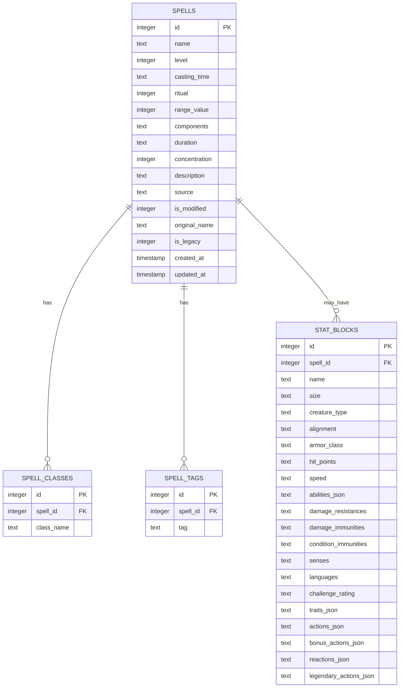

# Spellbook data ERD

```mermaid
erDiagram
    SPELLS {
        integer id PK
        text name
        integer level
        text casting_time
        integer ritual
        integer range_value
        text components
        text duration
        integer concentration
        text description
        text source
        integer is_modified
        text original_name
        integer is_legacy
        timestamp created_at
        timestamp updated_at
    }

    SPELL_CLASSES {
        integer id PK
        integer spell_id FK
        text class_name
    }

    SPELL_TAGS {
        integer id PK
        integer spell_id FK
        text tag
    }

    STAT_BLOCKS {
        integer id PK
        integer spell_id FK
        text name
        text size
        text creature_type
        text alignment
        text armor_class
        text hit_points
        text speed
        text abilities_json
        text damage_resistances
        text damage_immunities
        text condition_immunities
        text senses
        text languages
        text challenge_rating
        text traits_json
        text actions_json
        text bonus_actions_json
        text reactions_json
        text legendary_actions_json
    }

    SPELLS ||--o{ SPELL_CLASSES : has
    SPELLS ||--o{ SPELL_TAGS : has
    SPELLS ||--o{ STAT_BLOCKS : may_have
```

## Notes
- The main entity is SPELLS.
- SPELL_CLASSES and SPELL_TAGS are many-to-many link tables.
- STAT_BLOCKS are optional companion data for spells that summon creatures.
